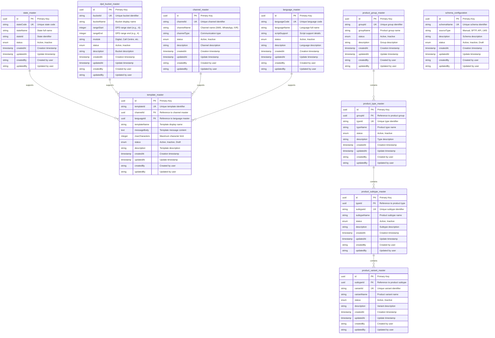

# Master Data Configuration Alignment - Database Design

## Entity Relationship Diagram

```mermaid
erDiagram
    state_master {
        uuid id PK "Primary Key"
        string stateCode UK "Unique state code"
        string stateName "State full name"
        string stateId "State identifier"
        enum status "Active, Inactive"
        timestamp createdAt "Creation timestamp"
        timestamp updatedAt "Update timestamp"
        string createdBy "Created by user"
        string updatedBy "Updated by user"
    }

    dpd_bucket_master {
        uuid id PK "Primary Key"
        string bucketId UK "Unique bucket identifier"
        string bucketName "Bucket display name"
        integer rangeStart "DPD range start (e.g., -6)"
        integer rangeEnd "DPD range end (e.g., 4)"
        string module "Digital, Call Centre, etc."
        enum status "Active, Inactive"
        string description "Bucket description"
        timestamp createdAt "Creation timestamp"
        timestamp updatedAt "Update timestamp"
        string createdBy "Created by user"
        string updatedBy "Updated by user"
    }

    channel_master {
        uuid id PK "Primary Key"
        string channelId UK "Unique channel identifier"
        string channelName "Channel name (SMS, WhatsApp, IVR)"
        string channelType "Communication type"
        enum status "Active, Inactive"
        string description "Channel description"
        timestamp createdAt "Creation timestamp"
        timestamp updatedAt "Update timestamp"
        string createdBy "Created by user"
        string updatedBy "Updated by user"
    }

    language_master {
        uuid id PK "Primary Key"
        string languageCode UK "Unique language code"
        string languageName "Language full name"
        string scriptSupport "Script support details"
        enum status "Active, Inactive"
        string description "Language description"
        timestamp createdAt "Creation timestamp"
        timestamp updatedAt "Update timestamp"
        string createdBy "Created by user"
        string updatedBy "Updated by user"
    }

    template_master {
        uuid id PK "Primary Key"
        string templateId UK "Unique template identifier"
        uuid channelId FK "Reference to channel master"
        uuid languageId FK "Reference to language master"
        string templateName "Template display name"
        text messageBody "Template message content"
        integer maxCharacters "Maximum character limit"
        enum status "Active, Inactive, Draft"
        string description "Template description"
        timestamp createdAt "Creation timestamp"
        timestamp updatedAt "Update timestamp"
        string createdBy "Created by user"
        string updatedBy "Updated by user"
    }

    product_group_master {
        uuid id PK "Primary Key"
        string groupId UK "Unique group identifier"
        string groupName "Product group name"
        enum status "Active, Inactive"
        string description "Group description"
        timestamp createdAt "Creation timestamp"
        timestamp updatedAt "Update timestamp"
        string createdBy "Created by user"
        string updatedBy "Updated by user"
    }

    product_type_master {
        uuid id PK "Primary Key"
        uuid groupId FK "Reference to product group"
        string typeId UK "Unique type identifier"
        string typeName "Product type name"
        enum status "Active, Inactive"
        string description "Type description"
        timestamp createdAt "Creation timestamp"
        timestamp updatedAt "Update timestamp"
        string createdBy "Created by user"
        string updatedBy "Updated by user"
    }

    product_subtype_master {
        uuid id PK "Primary Key"
        uuid typeId FK "Reference to product type"
        string subtypeId UK "Unique subtype identifier"
        string subtypeName "Product subtype name"
        enum status "Active, Inactive"
        string description "Subtype description"
        timestamp createdAt "Creation timestamp"
        timestamp updatedAt "Update timestamp"
        string createdBy "Created by user"
        string updatedBy "Updated by user"
    }

    product_variant_master {
        uuid id PK "Primary Key"
        uuid subtypeId FK "Reference to product subtype"
        string variantId UK "Unique variant identifier"
        string variantName "Product variant name"
        enum status "Active, Inactive"
        string description "Variant description"
        timestamp createdAt "Creation timestamp"
        timestamp updatedAt "Update timestamp"
        string createdBy "Created by user"
        string updatedBy "Updated by user"
    }

    schema_configuration {
        uuid id PK "Primary Key"
        string schemaName UK "Unique schema identifier"
        string sourceType "Manual, SFTP, API, LMS"
        string description "Schema description"
        enum status "Active, Inactive, Draft"
        timestamp createdAt "Creation timestamp"
        timestamp updatedAt "Update timestamp"
        string createdBy "Created by user"
        string updatedBy "Updated by user"
    }

    state_master ||--o{ template_master : "supports"
    dpd_bucket_master ||--o{ template_master : "supports"
    channel_master ||--o{ template_master : "supports"
    language_master ||--o{ template_master : "supports"
    product_group_master ||--o{ product_type_master : "contains"
    product_type_master ||--o{ product_subtype_master : "contains"
    product_subtype_master ||--o{ product_variant_master : "contains"
```